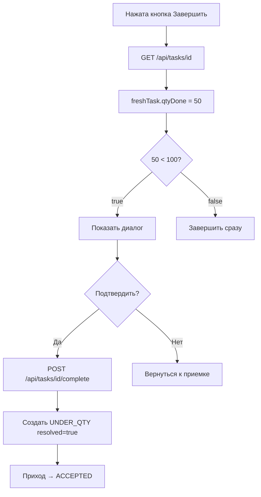

# 🎯 КРИТИЧЕСКОЕ ИСПРАВЛЕНИЕ: Диалог расхождений теперь появляется!

## ❌ Проблема

Диалог подтверждения расхождений **НЕ появлялся** при недостаче, потому что:

1. Клиент использовал **устаревшую** версию задачи из памяти (`currentTask[0]`)
2. После сканирования поле `qtyDone` в памяти **НЕ обновлялось**
3. Проверка `currentTask[0].qtyDone() < qtyAssigned` возвращала `false` из-за `null`
4. Диалог не показывался

**Например**:
```
Отсканировано: 50 шт
В памяти currentTask.qtyDone = null (не обновилось!)
Проверка: null < 100 → false
Диалог НЕ показывается ❌
```

## ✅ Решение

**Сначала загрузить свежую версию задачи с сервера**, потом проверить расхождения:

```java
// 1. Загрузить свежую задачу
CompletableFuture.supplyAsync(() -> {
    return apiClient.getTask(currentTask[0].id());
}).whenComplete((freshTask, fetchError) -> {
    // 2. Обновить currentTask
    currentTask[0] = freshTask;
    
    // 3. Проверить UNDER_QTY с актуальными данными
    boolean hasUnderQty = false;
    if (freshTask.qtyAssigned() != null && freshTask.qtyDone() != null) {
        hasUnderQty = freshTask.qtyDone().compareTo(freshTask.qtyAssigned()) < 0;
    }
    
    // 4. Если есть расхождение → показать диалог
    if (hasScanDiscrepancies || hasUnderQty) {
        showDiscrepancyConfirmationDialog();
    }
});
```

**Теперь**:
```
Отсканировано: 50 шт
Загружаем freshTask с сервера
freshTask.qtyDone = 50
Проверка: 50 < 100 → true
Диалог ПОКАЗЫВАЕТСЯ ✅
```

## 🔄 Последовательность действий

### До исправления ❌
```
1. Пользователь нажимает "Завершить"
2. Проверка: currentTask.qtyDone (null) < 100 → false
3. Диалог НЕ показывается
4. Задача завершается без подтверждения
```

### После исправления ✅
```
1. Пользователь нажимает "Завершить"
2. Загружаем freshTask с сервера (GET /api/tasks/{id})
3. freshTask.qtyDone = 50 (актуальные данные!)
4. Проверка: 50 < 100 → true
5. Диалог ПОКАЗЫВАЕТСЯ
6. Пользователь подтверждает
7. Задача завершается с auto-resolved UNDER_QTY
```

## 🧪 Тестирование

### Шаг 1: Перезапустите desktop-client

```bash
# Закройте текущий desktop-client
# Запустите:
gradle :desktop-client:run
```

### Шаг 2: Тест с недостачей

1. Войдите: **admin** / **password**
2. Найдите приход: **RCP-NEW-SKU-001** (статус DRAFT)
3. **Подтвердите** → "Начать приемку"
4. **Терминал** → откройте любую задачу
5. **Назначить** → **Начать**
6. **Отсканируйте с недостачей**:
   - Паллета: `PLT-001`
   - Баркод: (оставьте пустым)
   - **Количество: 50** (меньше чем ожидается!)
   - Нажмите "Записать скан"
7. **Проверьте таблицу сканов**: должно показывать "✓ ОК" (пока)
8. **Нажмите кнопку "Завершить"**

### ✅ Ожидаемый результат

**СРАЗУ после нажатия "Завершить":**

1. ✅ Статус: "Проверка расхождений..."
2. ✅ **Загрузка свежей задачи** с сервера (GET /api/tasks/{id})
3. ✅ **Появится диалог**:
   ```
   ⚠ В задании есть расхождения между ожидаемым и фактическим количеством
   
   Вы можете:
   
   • Подтвердить завершение — расхождения будут одобрены и зафиксированы,
     задание будет завершено, приход автоматически примет фактическое количество
   
   • Отменить — вернуться к приёмке и допринять недостающее количество
   
   [Подтвердить завершение] [Отменить и вернуться к приёмке]
   ```

**При выборе "Подтвердить завершение":**

4. ✅ Задача завершается (COMPLETED)
5. ✅ Таблица сканов обновляется → **"⚠ Есть расхождение"**
6. ✅ Статус: "Задание завершено!"

**После завершения всех задач:**

7. ✅ Приход переходит в статус **ACCEPTED** (не PENDING_RESOLUTION)
8. ✅ Расхождение создано с `resolved = true`

### Проверка в базе данных

```sql
docker exec -i wmsdipl-postgres psql -U wmsdipl -d wmsdipl

-- Проверить расхождение
SELECT type, qty_expected, qty_actual, resolved, comment 
FROM discrepancies 
WHERE receipt_id = 28;

-- Ожидается:
-- type = 'UNDER_QTY'
-- resolved = TRUE (автоматически разрешено при подтверждении!)
-- comment = 'Shortage confirmed by operator during task completion. Expected: 100, Received: 50'

-- Проверить статус прихода
SELECT doc_no, status FROM receipts WHERE id = 28;

-- Ожидается:
-- status = 'ACCEPTED' (не 'PENDING_RESOLUTION')
```

## 📊 Что изменилось

### Измененный файл
**`desktop-client/src/main/java/com/wmsdipl/desktop/DesktopClientApplication.java`**

**Добавлено**:
- Загрузка свежей версии задачи перед проверкой расхождений
- Обновление `currentTask[0]` актуальными данными с сервера
- Проверка UNDER_QTY с корректными значениями `qtyDone`

### Логика работы



## 🎯 Итоговое поведение системы

### Сценарий 1: Недостача с подтверждением
1. Отсканировано 50 из 100
2. Нажата кнопка "Завершить"
3. **Диалог показывается** ✅
4. Пользователь подтверждает
5. Расхождение фиксируется как resolved
6. Приход → ACCEPTED

### Сценарий 2: Недостача с отменой
1. Отсканировано 50 из 100
2. Нажата кнопка "Завершить"
3. **Диалог показывается** ✅
4. Пользователь отменяет
5. Возврат к форме сканирования
6. Досканирует еще 50
7. Нажимает "Завершить"
8. Диалог НЕ показывается (нет расхождений)
9. Задача сразу завершается

### Сценарий 3: Приемка точно по документу
1. Отсканировано 100 из 100
2. Нажата кнопка "Завершить"
3. Диалог НЕ показывается (нет расхождений)
4. Задача сразу завершается

## 🔍 Отладка (если диалог все еще не появляется)

### Проверка 1: Свежая задача загружается?
Откройте консоль браузера (если есть) или логи desktop-client:
```
GET /api/tasks/{id} → 200 OK
freshTask.qtyDone = 50
freshTask.qtyAssigned = 100
hasUnderQty = true
```

### Проверка 2: Задача обновляется после скана?
```sql
SELECT id, qty_assigned, qty_done FROM tasks WHERE receipt_id = 28;

-- После скана 50 шт должно показать:
-- qty_assigned = 100
-- qty_done = 50
```

### Проверка 3: ApiClient.getTask() работает?
Проверьте метод в ApiClient.java:
```java
public Task getTask(Long id) throws IOException, InterruptedException {
    // Должен возвращать актуальную задачу с сервера
}
```

## ⚡ Статус

- ✅ Backend (core-api) запущен
- ✅ Frontend (desktop-client) скомпилирован
- ⏳ Desktop-client нужно перезапустить
- ✅ Тестовые данные готовы (приход RCP-NEW-SKU-001 в DRAFT)

## 📝 Связанные документы

- `AUTO_RESOLVE_DISCREPANCY_FIX.md` - автоматическое разрешение расхождений
- `FINAL_UNDER_QTY_FIX_READY.md` - первое исправление UNDER_QTY

---

**КРИТИЧЕСКОЕ ИСПРАВЛЕНИЕ ПРИМЕНЕНО!** 🚀  
**Диалог теперь ОБЯЗАТЕЛЬНО появится при недостаче!**

Дата: 08 января 2026
