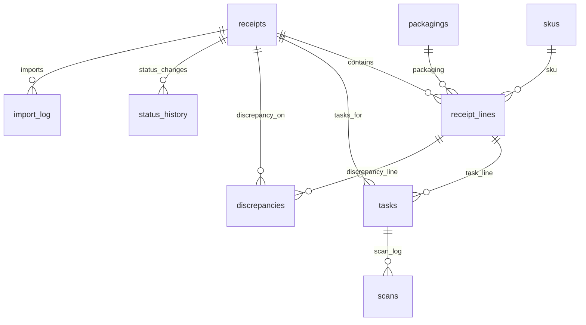

# ER Diagram (current DB schema)

Source: core-api db migration `db/migration/V1__init.sql` (PostgreSQL).

## Tables

- **receipts**: id, external_key, doc_no, doc_date, supplier, status, message_id (unique), created_at, updated_at; unique(doc_no, supplier); idx on status.
- **receipt_lines**: id, receipt_id FK→receipts (cascade), sku_id FK→skus, packaging_id FK→packagings, uom, qty_expected, sscc_expected, line_no.
- **skus**: id, code (unique), name, uom.
- **packagings**: id, code (unique), name, capacity, uom.
- **tasks**: id, receipt_id FK→receipts (cascade), line_id FK→receipt_lines (set null), assignee, status, qty_assigned, qty_done, created_at, closed_at; idx on status.
- **scans**: id, task_id FK→tasks (cascade), sscc, barcode, qty, device_id, discrepancy, scanned_at.
- **discrepancies**: id, receipt_id FK→receipts (cascade), line_id FK→receipt_lines (set null), type, qty_expected, qty_actual, comment, resolved, created_at.
- **import_log**: id, file_name, checksum, message_id (unique), status, error_message, processed_at.
- **status_history**: id, entity_id, entity_type, status_from, status_to, changed_by, changed_at (generic audit).

Notes:
- `receipt_lines`, `tasks`, `discrepancies`, `status_history` cascade on receipt deletion; scans cascade on task deletion.
- Status indexes: `idx_receipts_status`, `idx_tasks_status`.
- All IDs are `BIGSERIAL` (PostgreSQL).
